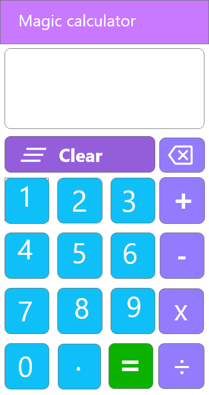
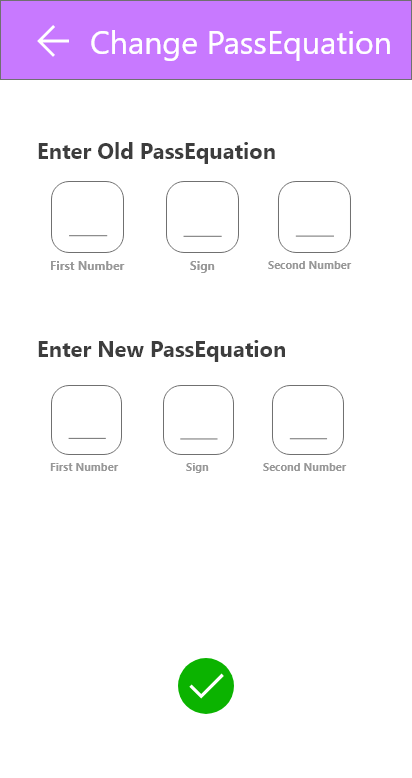
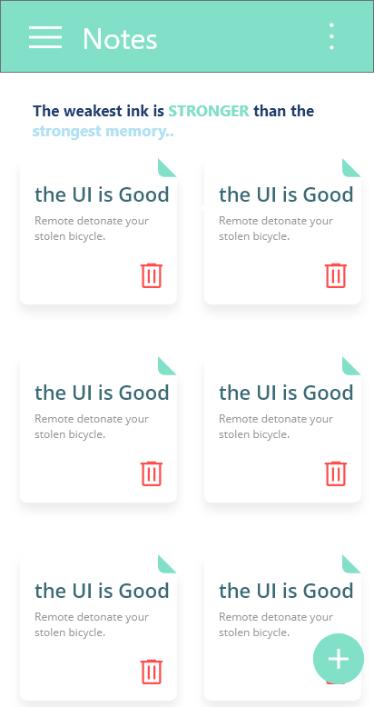
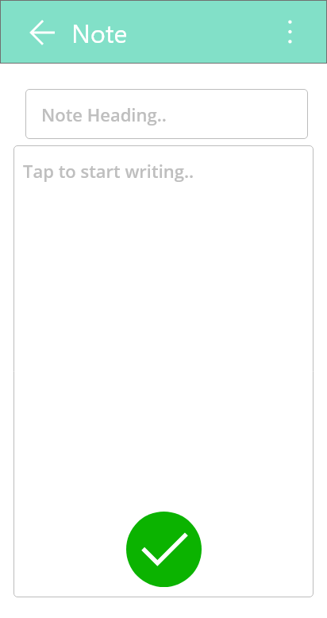
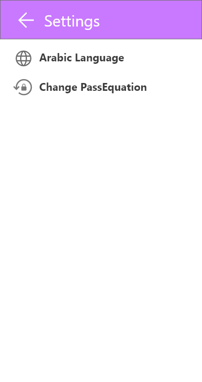

# magic_calculator
Magic Calculator is The first project for Gaza Sky Geeks Technical training course in Flutter.
This app is a creative idea where the app shows a simple calculator works extremely well for the four basic operations.
But, when the user enters an equation he set it previously a hidden app opens.

the hidden app enables the user to write journals, take notes, and set a To-Do list in a safe secret place!

